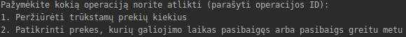
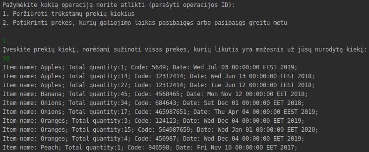
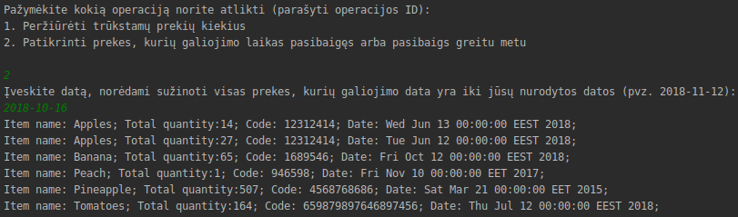
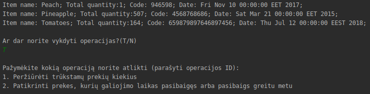

# Instrukcija (Naudojau IntelliJ aplinką)
1. Sukompiliavus programą turėsite pasirinkti operaciją, kurią norite atlikti (konsolėje įvesti operacijos ID pvz. “1”):
    * Įvesdami prekių kiekį, sužinosite visas prekes, kurių likutis yra mažesnis už jūsų nurodytą kiekį,
    * Įvesdami datą, sužinosite visas prekes, kurių galiojimo data yra iki jūsų nurodytos datos.
    
2. Pasirinkus pirmąjį variantą, programa jūsų prašys įvesti prekių kiekį, su kuriuo norite patikrinti prekių likutį, mažesnį už jūsų nurodytą. Jį įvedus, programa išves pagal pavadinimą surūšiuotą prekių sąrašą.
    
3. Pasirinkus antrą variantą, programą jūsų prašys įvesti datą, su kuria patikrinsite, visas prekes, kurių galiojimo data yra iki jūsų nurodytos datos. Ją įvedus, programa išves taip pat pagal pavadinimą surūšiuotą prekių sąrašą.
    
4. Taip pat, atlikus tam tikrą operaciją, galite tęsti sistemos darbą konsolėje parašydami - „T“.
    
